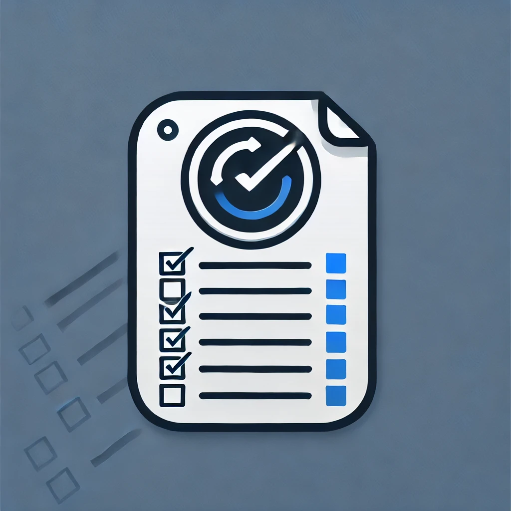

<!-- Improved compatibility of back to top link: See: https://github.com/kaiogerhardt/task-management-api/pull/73 -->
<a id="readme-top"></a>
<!--
*** Thanks for checking out the task-management-api. If you have a suggestion
*** that would make this better, please fork the repo and create a pull request
*** or simply open an issue with the tag "enhancement".
*** Don't forget to give the project a star!
*** Thanks again! Now go create something AMAZING! :D
-->


<!-- PROJECT SHIELDS -->
<!--
*** I'm using markdown "reference style" links for readability.
*** Reference links are enclosed in brackets [ ] instead of parentheses ( ).
*** See the bottom of this document for the declaration of the reference variables
*** for contributors-url, forks-url, etc. This is an optional, concise syntax you may use.
*** https://www.markdownguide.org/basic-syntax/#reference-style-links
-->


<!-- PROJECT LOGO -->
<br />
<div align="center">
  <a href="https://github.com/kaiogerhardt/task-management-api">
    
  </a>

  <h3 align="center">Task Management API</h3>

  <p align="center">
    Uma API poderosa para ajudar a organizar e gerenciar suas tarefas de forma eficiente!
    <br />
    <a href="https://github.com/KaioGerhardt/task-management-api/blob/main/docs/README.md"><strong>Documentação »</strong></a>
    <br />
    <br />
    <a href="https://github.com/kaiogerhardt/task-management-api">View Demo</a>
    ·
    <a href="https://github.com/kaiogerhardt/task-management-api/issues/new?labels=bug&template=bug-report---.md">Report Bug</a>
    ·
    <a href="https://github.com/kaiogerhardt/task-management-api/issues/new?labels=enhancement&template=feature-request---.md">Request Feature</a>
  </p>
</div>


<!-- TABLE OF CONTENTS -->
<details>
  <summary style="font-size: 18px;">Sumário</summary>
  <ol>
    <li>
      <a href="#sobre-o-projeto">Sobre o Projeto</a>
      <ul>
        <li><a href="#tecnologias">Tecnologias</a></li>
      </ul>
    </li>
    <li>
      <a href="#primeiros-passos">Primeiros Passos</a>
      <ul>
        <li><a href="#prerequisites">Pré requisitos</a></li>
        <li><a href="#installation">Instalação</a></li>
      </ul>
    </li>
    <li><a href="#usage">Utilização</a></li>
    <li><a href="#roadmap">Roadmap</a></li>
    <li><a href="#contribuindo">Contribuindo</a></li>
    <li><a href="#contato">Contato</a></li>
  </ol>
</details>


<!-- ABOUT THE PROJECT -->
## Sobre o Projeto

Existem muitos sistemas de gerenciamento de tarefas disponíveis, mas este projeto foi criado como um desafio pessoal para aprofundar meu conhecimento em desenvolvimento de APIs. O objetivo é construir uma aplicação que permita criar, organizar e acompanhar tarefas de maneira simples e eficiente.

Aqui estão os principais motivos por trás deste projeto:

* A prática constante leva à melhoria contínua. Este projeto me ajuda a aplicar e reforçar conceitos de desenvolvimento.
* Um sistema de gerenciamento de tarefas é um ótimo exemplo prático de CRUD, com funcionalidades amplamente utilizadas em sistemas reais.
* O código foi projetado para ser escalável e facilmente ajustável a novos recursos.

Embora este projeto seja voltado para o aprendizado pessoal, ele pode servir como base para outros projetos de APIs ou sistemas de gestão. Sinta-se à vontade para explorar e sugerir melhorias.

Use este projeto como referência ou inspiração para seus próprios projetos de APIs!

<p align="right">(<a href="#readme-top">Voltar ao topo</a>)</p>


## Tecnologias

As tecnologias usadas neste projeto incluem os principais frameworks e bibliotecas que ajudam a construir uma aplicação robusta e escalável.


* [](https://spring.io/projects/spring-boot)
* [](https://www.postgresql.org/)
* [](https://www.docker.com/)
* [](https://maven.apache.org/)
* [](https://jwt.io/)

<p align="right">(<a href="#readme-top">Voltar ao topo</a>)</p>


<!-- GETTING STARTED -->
## Primeiros Passos
Siga as etapas abaixo para obter uma cópia local do projeto e colocá-lo em execução.

## Pré-requisitos
Você precisará das seguintes ferramentas instaladas no seu ambiente local:

* Docker (para gerenciar contêineres)
* Git (para clonar o repositório)
* Java 17+ (caso deseje rodar sem Docker)

## Instalação

### Clone o repositório

Primeiro, clone o repositório Git para a sua máquina:

```
git clone https://github.com/kaiogerhardt/task-management-api.git
cd task-management-api
```

### Rodar o projeto com Docker
***

Certifique-se de que o Docker está instalado e rodando. Em seguida, construa e execute o projeto com o Docker Compose:
```
docker-compose up --build
```

Isso irá configurar o PostgreSQL e a aplicação Spring Boot automaticamente.

### Acessar a aplicação

Após a execução, você pode acessar a API no navegador ou usando ferramentas como Postman:

```
http://localhost:8080/api/tasks
```

<p align="right">(<a href="#readme-top">Voltar ao topo</a>)</p>

<!-- USAGE EXAMPLES -->
## Usage

Use this space to show useful examples of how a project can be used. Additional screenshots, code examples and demos work well in this space. You may also link to more resources.

_For more examples, please refer to the [Documentation](https://example.com)_

<p align="right">(<a href="#readme-top">back to top</a>)</p>


<!-- ROADMAP -->
## Roadmap

- [x] Add Changelog
- [x] Add back to top links
- [ ] Add Additional Templates w/ Examples
- [ ] Add "components" document to easily copy & paste sections of the readme
- [ ] Multi-language Support
    - [ ] Chinese
    - [ ] Spanish

See the [open issues](https://github.com/kaiogerhardt/task-management-api/issues) for a full list of proposed features (and known issues).

<p align="right">(<a href="#readme-top">back to top</a>)</p>


<!-- CONTRIBUTING -->
## Contribuindo

Contribuições são o que fazem da comunidade open source um lugar incrível para aprender, inspirar e criar. Qualquer contribuição que você fizer será muito bem-vinda!

Se você tem uma sugestão para melhorar este projeto, sinta-se à vontade para fazer um fork do repositório e criar um pull request. Você também pode abrir uma issue com a tag "enhancement" para discutir novas ideias.

Não se esqueça de dar uma estrela no projeto! Agradeço desde já!

Como Contribuir:
1. Faça um fork do projeto.
2. Crie uma nova branch para sua feature (git checkout -b feature/NomeDaFeature).
3. Commit suas alterações (git commit -m 'Adiciona NomeDaFeature').
4. Faça o push para a branch (git push origin feature/NomeDaFeature).
5. Abra um pull request.

### Top contributors:

<a href="https://github.com/kaiogerhardt/task-management-api/graphs/contributors">
  
</a>

<p align="right">(<a href="#readme-top">back to top</a>)</p>

<!-- CONTACT -->
## Contato

Tem alguma dúvida ou sugestão? Fique à vontade para entrar em contato! Será um prazer ajudar.

**Kaio Gerhardt**  
[](https://linkedin.com/in/kaiogerhardt)  
[](https://instagram.com/kaiogerhardt) <br>
[](mailto:gerhardt.kaio@gmail.com)

Você pode conferir este projeto no GitHub:  
[](https://github.com/kaiogerhardt/task-management-api)

<p align="right">(<a href="#readme-top">back to top</a>)</p>
